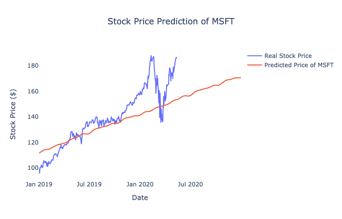
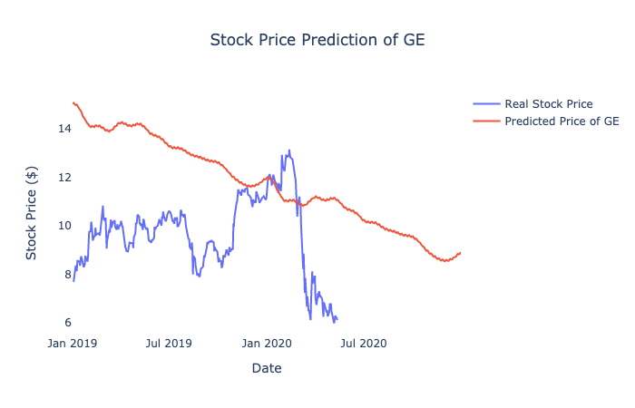

# Supplemental Files for Medium Post - Predicting S&P 500 with Time-Series Statistical Learning

This folder consists the supplemental files for my Medium Post of <a hred="https://medium.com/@jjsham/predicting-s-p-500-with-time-series-statistical-learning-8b9277e30b2a">Predicting S&P 500 with Time-Series Statistical Learning</a>. This Medium Post is about my project of [S&P 500 Prediction](../SP500Prediction) which is part of my project of [Stock Analytics](..).

## S&P 500 Index
S&P 500 is a capitalization-weighted index in the United States. This index takes the weighted average of the top 500 market capitalization companies to reflect the average of the stock market. The following list is the top 20 weighted stocks in the index:
<ul>
	<li><b>General Electric</b> (GE): 2.95%</li>
	<li><b>Bank of America</b> (BAC): 2.93%</li>
	<li><b>Microsoft</b> (MSFT): 2.56%</li>
	<li><b>AT&T</b> (T): 2.41%</li>
	<li><b>Pfizer</b> (PFE): 1.88%</li>
	<li><b>Comcast</b> (CMCSA): 1.54%</li>
	<li><b>Apple</b> (AAPL): 1.47%</li>
	<li><b>Coca-cola</b> (KO): 1.45%</li>
	<li><b>Cisco</b> (CSCO): 1.43%</li>
	<li><b>Intel</b> (INTC): 1.43%</li>
</ul>
  
The accuracy of the stock price predictive model of the top 20 weighted stocks in the index:
<ul>
	<li><b>General Electric</b> (GE): Negative R-square</li>
	<li><b>Bank of America</b> (BAC): Negative R-square</li>
	<li><b>Microsoft</b> (MSFT): 62.98% R-square</li>
	<li><b>AT&T</b> (T): 5.68% R-square</li>
	<li><b>Pfizer</b> (PFE): Negative R-square</li>
	<li><b>Comcast</b> (CMCSA): Negative R-square</li>
	<li><b>Apple</b> (AAPL): 76.31% R-square</li>
	<li><b>Coca-cola</b> (KO): 24.12% R-square</li>
	<li><b>Cisco</b> (CSCO): Negative R-square</li>
	<li><b>Intel</b> (INTC): 27.95% R-square</li>
</ul>
 
 
The above stocks with negative R-square is the priority to improve their stock price predictive model.

## Adaptive Model (Time Series) Apporoach
The baseline model is the first approach to predict S&P 500. The baseline model is a predictive model of S&P 500 using adaptive model in time-series statistical model. This approach trains the predictive model with Facebook Prophet and the index between 1997-2018 for training data set. The baseline model validated with testing data with index between 2019-May 2020, that the model has achieved a 10.69% R-square. You may find more detail and the code in the [Baseline Model folder](../SP500Prediction/BaselineModel).
  
The visualization of the prediction looks like this:
 

## Stock Price Aggregation Model
he Stock Price Aggregation Model takes the nature of index calculation of S&P 500, it predicts the stock price of all S&P 500 components and calculate the S&P 500 using all predicted stock price. This approach consists 4 parts - Data Acquisition, Stock Price Prediction, Index Calculation, and Evaluation. You may view the code of the data acquistion part in the [ETL folder](../SP500Prediction/ETLPipelines), Stock Price Prediction part in the [Dynamic folder](../SP500Prediction/PredictionPrice/Dynamic) in the Stock Price Prediction folder, Index Calculation and Evaluation in the [Stock Price Aggregation Model folder](../SP500Prediction/Prediction_AggStockPrice). This folder contains a Python file, <i>Visualization_PredictedPrice.py</i> to visualize the stock price prediction of a selected stock. This file requires the predicted stock price saved in the local database and Plotly to plot the visualization. I have visualized the predicted stock price of Microsoft (MSFT) and General Electric (GE):
  

 

## Dashboard
Coming Soon...