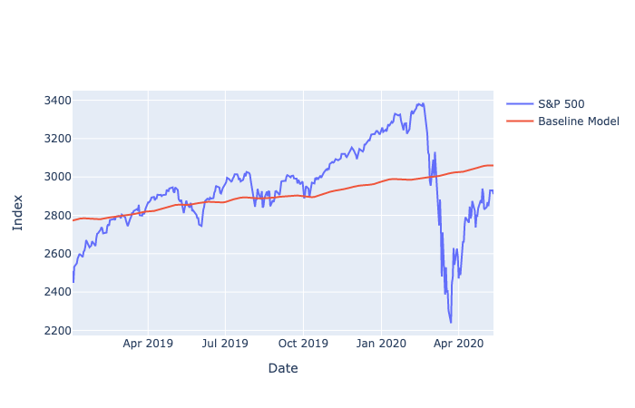
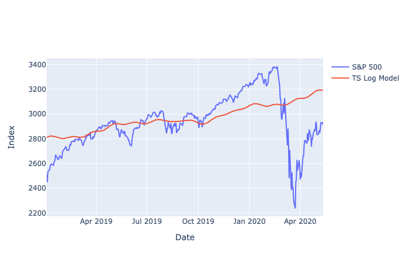
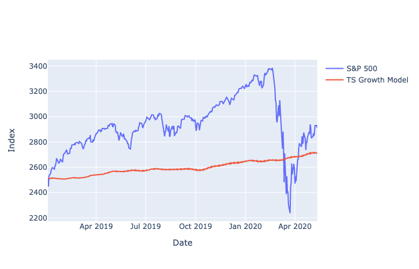

# Baseline Model
The baseline model is the first approach to predict S&P 500. The baseline model is a predictive model of S&P 500 using adaptive model in time-series statistical model. 

## File
There is one Python file in this folder, <i>Prediction_Basemodel.py</i>. The program obtain training data and testing data first and use the training data for model training using Facebook Prophet. The file also consists the modificated versions of baseline models for experiments. After the model is trained, the program predict the index and evaluated with the testing data. Finally, it saved the result in a text file and generate 3 line charts on the predictions from 3 models trained in the file.

## Packages Used
<ul>
	<li>pandas</li>
	<li>numpy</li>
	<li>psycopy2</li>
	<li>Facebook Prophet</li>
	<li>Plotly</li>
</ul>

## Training and Testing Data
The training data is set the data between 1997 and 2018 to include at least 2 bull markets before recessions. In between 1997 and 2018, there are 2 recessions in the US: Dot Com buddle and 2008 Credit crisis. 1997 is the start of the bull market before the Dot Com buddle, and therefore, the training data starts here. The testing data is set the date between 2019 and May 2020. Both data sets should be prepared and saved in the local database at this point.

## Baseline Model
The first approach is to train a time-series model with Prophet. The baseline model is simply training an additive model with Facebook Prophet. In the <i>Prediction_Basemodel.py</i> file, the program first obtain data from the local database with the index between 1997 and 2018 for training data set, and index between 2019 and May, 2020 for testing data set. Then, use the training data set to train the time-series model with Prophet. This model will be called the <b>baseline model</b>. After that, obtain the R-square with testing data set for evaluation.

## Modified Versions of Baseline Model
There are two modification on the baseline model. The first modification is to take natural log on the index before model training and take an exponential after the prediction is made. This model will be called <b>Times Series Log Prediction Model</b>. Another modification is to convert the index to growth rate and let the growth rate be the response variable for model training. After the model predict the growth rate, calculate the index by scaling the growth with the index of the first prediction period. This model will be called <b>Time Series Growth Prediction Model</b>. At the end, both modified version models will evaluate with the baseline model with R-square.

## Result
The file <i>Prediction_Basemodel.py</i> trained those 3 models and calculate the R-squared and RMSE of each model. It relies the function save_result_rmse() from <i>Results.py</i> to save the results in text files. The result is saved as (Model Name).txt format in the Results folder.
 
 
The results are:
<ul>
	<li><b>Baseline Model</b> - R-squared: 10.69%    RMSE: 198.32</li>
	<li><b>Times Series Log Prediction Model</b> - R-squared: 3.8%    RMSE: 205.83</li>
	<li><b>Time Series Growth Prediction Model</b> - R-squared: Negative   RMSE: 387.51</li>
</ul>
 
The baseline model has the highest R-squared or lowest RMSE, both modificated model did not perform better than the baseline model. As the result, the baseline model is the best model among three models.

## Visualization
The program would visualizate the results in line charts with Plotly at the end. The result of the basline model looks like this:
 

  
The result of the Times Series Log Prediction Model looks like this:
 

  
The result of the  Time Series Growth Prediction Model looks like this:
 

  

## Next Approach
In the next approach, we are going to predict S&P 500 by aggregating predicted stock price from 505 components in the S&P 500. You may find more details in the [Stock Price Aggregation Model Folder](../Prediction_AggStockPrice)
