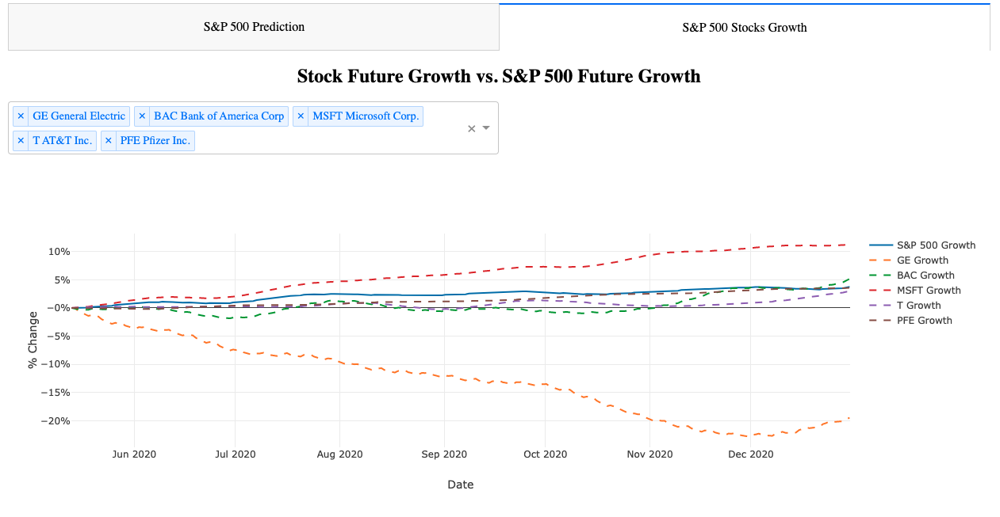
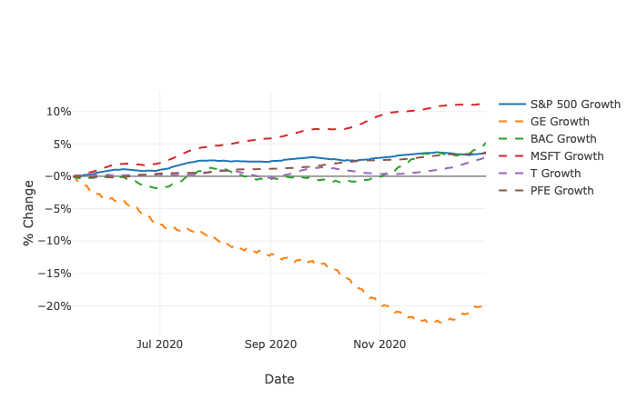

# Dashboard of Prototype S&P 500 Prediction Model

The goal of this dashboard is to display the predicted S&P 500 and the growth rate of S&P 500 and its components between May and December 2020. The dashboard is powered by Dash and ingest data from the local database which contains the predicted stock price and index.

## File
There is 1 file in this folder: <i>Prediction_SP500_dashboard.py</i>.

## Packages Used
<ul>
	<li>pandas</li>
	<li>psycopy2</li>
	<li>Plotly</li>
	<li>Dash</li>
</ul>

## Data Requirement
<ul>
	<li>Both predicted SP 500 and predicted stock prices are stored in the local database, in the <i>pred_proto_sp500</i> table and <i>stock.pred_proto_staging</i> table. </li>
	<li>The SP500 in prior to May 2020 shall be stored in the local database, in the <i>stockprice</i> table</li>
</ul>

## How program works
Coming Soon...

## Images
The default page of the dashboard display the prediction of S&P 500:
 

  
The 2nd tab displays the growth of stock price in comparison with the growth of index. By default, no stock is selected and only the growth of the index is displayed:
 

  
If you selected the top 5 weighted stocks of S&P 500, the dashboard will generate a chart displaying the growth of the index and the stock price growth of the selected stocks:
 

