# Simple Stock Price Dashboard
There are a lot of stock price dashboards in the market but most of those are not suiting my needs. In this part, I am going to develop tail-make a dashbaord for stock analysis. The first dashboard is aimed to develop a dashboard to analyze stocks with fundamental and basic technical analysis. 
 
 
I have a Medium post talks about this dashboard, please find the post <a href="https://medium.com/@jjsham/building-stock-price-dashboard-with-plotly-dash-part-i-b165b3edfdd6">here</a>

## Background
Besides only looking at the fundamentals and technical analysis of a single stock, it is helpful to compare the stock price trend with some benchmark index to understand whether the stock is outperform or underperform in the stock market. However, there are no a lot of tools out aimed to compare the growth trend between stock price and index in my desired format. Therefore, I would like to develop a dashboard to serve my goals for stock price analysis.

## Goal
To develop a dashboard to serve the following goals:
1. Display the trend of stock price, basic statistics of a stock selected by user.
2. Display the trend of growth rate of selected stocks along with the trend of growth rate index for comparsion (Benchmark Growth).

## Data
There are two required data in this dashboard:
<ul>
	<li>List of companies included in the given indexes</li>
	<li>Infomation and Statistics of Stock Price and Index</li>
</ul>
The list of companies included in given indexes are obtained from Wikipedia and saved in csv files in the <a href="https://github.com/jacquessham/StockAnalytics/tree/master/SimpleDashboard/Data">Data folder</a>, each file is named in XXXXStockList.csv while XXXX represents the index of a given stock market. Each file contains the list of companies included in the index along with the ticker. The infomation and statistics of stock price and index would be obtained from Yahoo Finance on-demand. In each user's action, the program requests the required infomation and statistic of the selected stock and/or index from yfinance API (Which is an API for Yahoo Finance). yfinance requires a stock/index ticker to request the infomation and statistic of stock/index. The reason of not using Quandl is the data of US stocks and Global indexes are not free while Yahoo Finance is free. If there is other access to the data of stock price or index, it is okay to replace with yfinance.

## Tools
The dashboard is built with Python and Dash. It relies on the following packages:
<ul>
	<li>pandas - Data manipulation</li>
	<li>re - Regex in Python</li>
	<li>datetime - For date format</li>
	<li>plotly - Build visualizations on the dashboard</li>
	<li>dash, dash_core_components, dash_html_components, dash.dependencies - Dashboard tools built with Dash</li>
	<li>yfinance - API for stock price or index</li>
</ul>

## Strategy
The dashboard would be built with 2 tabs to serve the purposes of each goal. Tab 1 would be serving the first goal to display the price and statistics of 1 stock, while Tab 2 would be sering the second goal to compare index growth and selected stock(s) price growth.
  
On Tab 1, there are a text box for user to enter a stock ticker. Once the user hits the submit button next to it, the program would convert the format which yfinance accepts and request the price and statistic of such stock from yfinance. After the data is obtained, the program would display the company name, ticker, price, price change and percentage of the price change on the top. Then, it would generate a candlestick graph of stock price along with moving averages on the bottom right of the dashboard. Lastly, it would generate a table of statistics of the stock, such as PE ratio, EPS, on the bottom left of the dashboard.
  
On Tab 2, there are two dropdown lists for user to select. The first dropdown list is for user to select a index; the second dropdown list is for users to select multiple stocks within the index selected in the first dropdown list for comparsion. Once the users has selected a index and a list of stocks, the program would obtain the ticker from the csv files and request the index and the stock price. Then, the program would convert the data to growth rate and display on the dashboard.

## Design
The tabs are designed with HTML format like the following:
 

  

  
Once it is built in Dash, the default setting looks like the following:
 

 
 
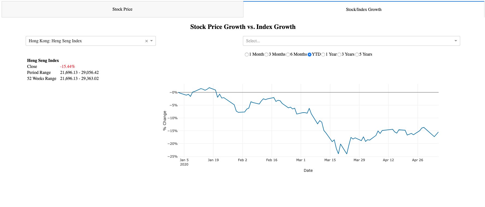
  
But once a stock is selected in Tab 1, it would look like this:
 
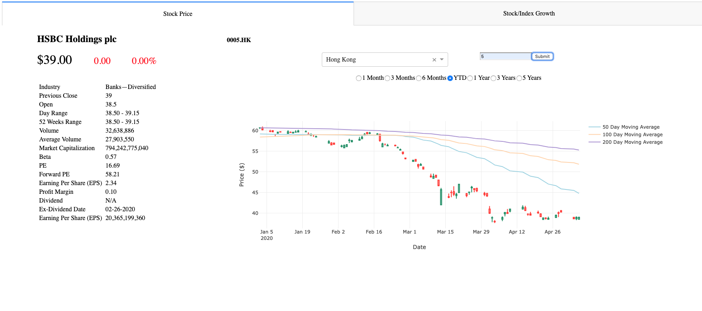

## Files
There are 2 python files:
<ul>
	<li>SimpleDashboard.py - The Driver program.</li>
	<li>Layout.py - The helper code to define layout and generate visualization and Html tables.</li>
</ul>
  
In the <a href="https://github.com/jacquessham/StockAnalytics/tree/master/SimpleDashboard/Data">Data Folder</a>, there are csv files to store the list of companies within a given index. Currently, there are 2 indexes available:
<ul>
	<li>Hong Kong: Heng Seng Index</li>
	<li>United States: S&P 500</li>
</ul>
  
The driver program consists two main parts, the dashboard of base layout and call back functions. The base layout define the base layout of the dashboard, and relies on the detail layout in Layout.py. There is 1 call back function (Along with 2 helping functions) for Tab 1, and 2 call back functions for Tab 2.
  
In Layout.py, there is 1 function each to define the specific detail layout of Tab 1 and Tab 2, 4 functions to define the detail layout of table and graph for both Tab 1 and Tab 2, and 4 functions to help the call back functions to generate HTML tables and visualizations.

## Tab 1 - Stock Price
This tab is aimed to serve the goal of displaying stock price for fundamental and basic technical analysis of the selected stock. Once the stock is entered by the user, the dashboard would display the infomation and statistics of the stock price and the candlestick chart of stock price along with moving averages for the users.
  
There are 3 inputs and 1 action required from the user:
<ul>
	<li>Stock Market from Dropdown list</li>
	<li>Ticker from the text box</li>
	<li>Time interval from the radio item lists</li>
	<li>Submit button to trigger the call back function</li>
</ul>
  
The only call back function, get_ticker(), is triggered the following situation initial set up, by hitting the submit button, or changing time interval. There are 2 Input() and 2 State(). Input() are inputs received from the n_click button and value from the time interval radio button list. The input from time interval radio button list has to be Input() because the graph does not update automatically if it is set to be State(). The program does not update the dashboard from entering new ticker unless the user hit the button. The dropdown list is set to receive the choice of stock market for the convenience for ticker formatting before calling the API. 
  
There are 10 outputs from this call back function:
<ol>
	<li>Company Name of the stock</li>
	<li>Ticker of the stock</li>
	<li>Stock Price</li>
	<li>Stock Price Change</li>
	<li>Colour of Stock Price Change</li>
	<li>Stock Price Percentage Change</li>
	<li>Colour of Stock Price Percentage Change</li>
	<li>Error Message under the text box</li>
	<li>Visualization</li>
	<li>HTML Table for stock statistics</li>
</ol>
 
There are 5 returns of this call back functions:
<ul>
	<li>Default Setting</li>
	<li>Error from entering wrong ticker format</li>
	<li>Error from entering ticker which does not exist</li>
	<li>Error from entering ticker which does not have full information from the API</li>
	<li>Successful Return</li>
</ul>
 
Once the program has gathered the inputs from the users, it would follow the following steps:
<ol>
	<li><b>Verify if there is a ticker entered.</b> If not, it means this is a dashboard initializing. If there is no ticker entered, the function return a default Setting.</li>
	<li><b>Verify ticker format.</b> It calls a helping function, verify_ticker(), to help verify the ticker format. It requires the ticker user entered, and the stock market user selected from the dropdown list. Since the ticker format is different across stock market, the verify_ticker() has set has a if-else condition to testify which stock market the user has selected. Then, the function use regex to verify the stock format based on which stock market has selected. If the stock format is valid, the function also reformat the ticker to the Yahoo Finance accepted format. For example, if a user entered '5' for HSBC Holdings for Hong Kong Stock Market, the function transforms the ticker to '0005.HK' which is the accepted format in Yahoo Finance. If the ticker format is not valid, the program would display error message on the dashboard to the user.</li>
	<li><b>Request data from Yahoo Finance.</b> The program request the data from Yahoo Finance API. If the stock ticker does not exisit in Yahoo Finance, the API would return a empty Pandas data frame. And if this is the case, the program would display an error message on the dashboard. </li>
	<li><b>Data Manipulation.</b> Once the data set is returned from Yahoo Finance, the program would manipulate the data set to obtain, price change, price change in percentage, data set needed to graph, include stock price and moving average. In order to calculate the moving average, the call back function calls the helper function, getMA() to calculate.</li>
	<li><b>Generate HTML table and Visualization.</b> Once the data set is ready, the call back function calls getCanlestick() from <i>Layout.py</i> to prepare the layout of the HTML table and the visualization. Note that the this step and last step are set in the try-catch function. If the statistics of the stock is not available in Yahoo Finance, the program would catch the error and display the error on the dashboard to ask user to pick another stock.</li>
</ol>

## Tab 2 - Comparsion between the Growth of Stock Price and Index
This tab is aimed to serve the goal to display the trend of the growth of stock price and index. Once the user select an index and a list of stocks, the dashboard would display the growth trend of index and the growth trend of stock price of selected stocks.
  
There are two dropdown list in this tab, one is for index selection, one is for stock(s) selection. Once the user has select an index, the program would call generate_dropdown_stocknames() to generate a new list of stocks in the index in another dropdown list. In other words, the stock dropdown list relies on what user select in the first dropdown list.
  
There are 2 call back functions in this tab:
<ul>
	<li>generate_dropdown_stocknames()</li>
	<li>generate_tab2_graph</li>
</ul>
 
As mentioned, generate_dropdown_stocknames() generates a list of stocks what index user has selected. For example, if the user select S&P 500, this call back function returns a list of companies in S&P 500. This function takes 1 input and return 2 outputs. It takes the value selected from the first dropdown list. The call back function verify the selection and read the list of companies from the Data folder. After that, it return the list of companies sort by ticker (number or alphabetical letters) and a default value of the dropdown list. Note that the default value of dropdown list is always a empty list to represent no selection and prevent error in other functions.
  
generate_tab2_graph() generates the HTML table and visualization on Tab 2. This call back functions takes 3 inputs: The index user selected from the first dropdown list, the list of stocks user selected, and the time interval on the visualization. Once all those inputs gathered from the users, the program would obtain the index and the stock price of the selected stocks by calling Yahoo Finance. Once the data is obtained, the call function would calculate the growth rate of index and each stock by calling the helper function, get_price_change(), and call getLinePlot() from <i>Layout.py</i> to obtain a line chart. After that, it would obtain the statistics of the index and generate a HTML table by calling getTab2Table() from <i>Layout.py</i>. 

## Driver Program - SimpleDashboard.py
There are 2 parts of the program: Dashboard Layout and Callback Functions. The Dashboard Layout part defines the layout of the dashboard, this part relies on the following functions from <i>Layout.py</i>:
<ul>
	<li>get_tab1_info_box() - For Tab 1</li>
	<li>get_tab2_info_box() - For Tab 2</li>
	<li>get_interval_layout() - For Tab 1 and Tab 2</li>
	<li>get_graph_layout() - For Tab 1 and Tab 2</li>
	<li>get_table_layout() - For Tab 1 and Tab 2</li>
	<li>get_stats_graph_layout() - For Tab 1 and Tab 2</li>
</ul>
 
There are 3 call back functions, each call back function has its own helper functions.

### Tab 1 Call Back Function
get_ticker() is the only call back function for Tab 1. This function requires 4 inputs:
<ol>
	<li>n_click, from the button: used to trigger the call back function, the infomation of n_click is not used in the function</li>
	<li>time, from the selection of time interval selection: For the time interval display on the visualization</li>
	<li>ticker, value from the text box: Ticker of the stock</li>
	<li>mkt, the value of the stock market dropdown list: Indicate the format of the ticker in the given stock market when calling verify_ticker()</li>
</ol>
This call back function relies on 2 helping function:
<ul>
	<li>verify_ticker(): Verify the ticker format and transform the ticker to the format required by Yahoo Finance.</li>
	<li>getMA(): Calculate the 50-, 100-, 200-day moving average</li>
</ul>
 
This call back function return 10 outputs as mentioned:
<ol>
	<li>Company Name of the stock</li>
	<li>Ticker of the stock</li>
	<li>Stock Price</li>
	<li>Stock Price Change</li>
	<li>Colour of Stock Price Change</li>
	<li>Stock Price Percentage Change</li>
	<li>Colour of Stock Price Percentage Change</li>
	<li>Error Message under the text box</li>
	<li>Visualization</li>
	<li>HTML Table for stock statistics</li>
</ol>
 
There are 5 return cases to this call back function:
<ol>
	<li>Default Setting: no stock selected </li>
	<li>Ticker entered in wrong format: Display Error</li>
	<li>Ticker entered not available in Yahoo Finance: Display Error</li>
	<li>Ticker entered available in Yahoo Finance but not all the infomation required by dashboard: Display Error.</li>
	<li>All required outputs available: Successfully Display on the dashboard</li>
</ol>
 
Note that the first 3 cases are testify by if-else statement in the program. The 4th case is testify in a try-catch function and is caught when there is an error.
  
The call back functions relies on 2 functions from <i>Layout.py</i>:
<ol>
	<li>getCandlestick() - Plot Visualization</li>
	<li>getTab1Table() - Generate a HTML table</li>
</ol> 

### Tab 2 Call Back Functions
There are 2 call back function for Tab 2: generate_dropdown_stocknames() and generate_tab2_graph().
  
generate_dropdown_stockanmes() takes 1 input, mkt, which tells the program which stock market user selected. The call back function figures out which index, and obtains the list of companies included in the selected index, that the list of companies are obtained by reading the csv files in the data folder. The call function returns this list of companies and the default selected stocks. The default selected stocks is always an empty list. If there is an error, the call back function returns 2 empty lists.
  
generate_tab2_graph() has 1 helper function and takes 3 inputs:
<ol>
	<li>mkt: Index selected</li>
	<li>stocks: List of stocks selected by user</li>
	<li>time: Time interval selected by user</li>
</ol>
 
This call back function first obtain the index data and stock price of selected stocks first. Then, the call back function call the helper function, get_price_change(), to obtain the growth rate of index and stock price. Then, the call back function call getLinePlot() from <i>Layout.py</i>. After that, the call back function obtains the index statistics and call getTab2Table() to generate a HTML table. The call back function returns a HTML table and the line chart.

## Helper Code - Layout.py
The <i>Layout.py</i> helps defines the detail layout of the dashboard, the helping functions to generate all types of visualizations, and global variables.

### Detail Layouts for Tab 1, Tab 2, or both Tab 1 and Tab 2
<ul>
	<li><b>get_tab1_info_box()</b>: For Tab 1 layout to display Price, price change, dropdown list to select stock market, textbox to enter ticker, and submit button</li>
	<li><b>get_tab2_info_box()</b>: For Tab 2 layout to display dropdown lists to select stock market and stocks.</li>
	<li><b>get_stats_graph_layout()</b>: For both Tab 1 and Tab 2 to display HTML table and visualization. This function relies get_interval_layout(), get_graph_layout(), and get_table_layout().</li>
	<li><b>get_interval_layout()</b>: Display a radio button list for time interval</li>
	<li><b>get_graph_layout</b>: Define a layout to display the radio button list and dcc.Graph(). This function relies on get_interval_layout().</li>
	<li><b>get_table_layout</b>: Define a div for HTML table</li>
</ul>

### Functions to Generate Graphs
There are two graphing functions: getLinePlot() and GetCandlestick().
  
getLinePlot() takes 2 inputs, a data frame and tab number. The tab number helps set different y-axis for either tabs. The function takes the data frame to plot a line chart. <i>Date</i> column would always be on x-axis, and each line is plotted based on each column. The function returns the figure dictionary. The function can be used for either tabs but currently only Tab 1 relies on this function.
   
getCandlestick() takes 1 input, the data frame of stock prices. The data frame must include the following columns with the exact names:
<ul>
	<li>Date - Date</li>
	<li>Open - Opening Price</li>
	<li>Close - Close Price</li>
	<li>High - Daily High</li>
	<li>Low - Daily Low</li>
	<li>MA50 - 50-day moving average</li>
	<li>MA100 - 100-day moving average</li>
	<li>MA200 - 200-day moving average</li>
</ul>
 
The function takes <i>Date</i>, <i>Open</i>, <i>Close</i>, <i>High</i>, <i>Low</i> plot a candle stick chart for the stock price, and takes <i>MA50</i>, <i>MA100</i>, <i>MA200</i> to plot 3 lines of 50-,100-,and 200-day moving average on top of the candle stick charts. 

### Functions to Generate Tables
There are 2 functions to generate HTML tables, getTab1Table() and getTab2Table(), each is responsible to generate the HTML tables for either tabs.
  
getTab1Table() takes 2 inputs: Data frame of stock price and stock object obtained from Yahoo Finance. This function obtains price-related information from the data frame of stock price and statistic from the stock object. Within stock object, there is a dictionary, <i>info</i>, which stores the current statistic of the given stock. This function generates a HTML table with the following infomation:
<ul>
	<li>Industry of the Company</li>
	<li>Previous Close Price</li>
	<li>Opening Price</li>
	<li>Day Range of Stock Price</li>
	<li>52 Weeks of Stock Price</li>
	<li>Volume in a day</li>
	<li>Average volume in 10 days</li>
	<li>Market Capitalization</li>
	<li>Beta</li>
	<li>Price-Earning Ratio (PE)</li>
	<li>Forward Price-Earning Ratio (FPE)</li>
	<li>Earning per Share (EPS)</li>
	<li>Profit Margin</li>
	<li>Dividend</li>
	<li>Ex-Dividend Date</li>
	<li>Outstanding Shares</li>
</ul>
  
getTab2Table() takes 4 inputs:
<ul>
	<li>Name of the index</li>
	<li>The last-day change of index</li>
	<li>The range of index in the selected time interval, store in tuple</li>
	<li>The range of index in the selected 52 weeks, store in tuple</li>
</ul>
 
The function first determine whether the last-day change of index is positive or negative. Then, the function plot all info in a HTML table. Note that the last-day change is displayed in percentage and green if rising or red if dropping.

### Global Variables
There are 2 global variables for selections of Tab 1 and Tab 2 dropdown list: <i>tab1_markets</i> and <i>index_choice</i>. If there is any change in the global variables, one must update the call back functions to accommodate the change.

## Direction
### Analyze One Stock
If you would like to look at the stock price of one stock, first open this dashboard and the dashboard would land on a default setting page.
 

 
Then, select the stock market of where the stock is trade. In this example, let's select General Electric (GE). Then, select <i>United States</i> on the drop list.
 
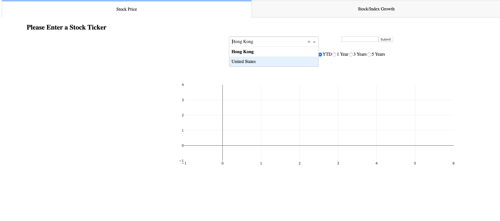
 
Enter the ticker and hit the submit button. All the infomation and the visualization will be displayed on the dashboard.
 

 
Note that you have to select the correct stock market before hitting submit. If you select <i>Hong Kong</i> and enter a US stock ticker, the dashboard will display an error.
 
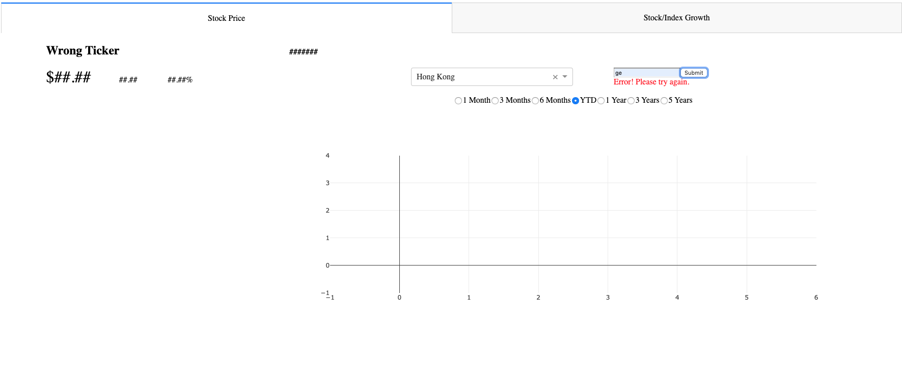

### Compare Growth Trend of index and Stock Price
If you would like to compare the growth trend between index and the growth trend  stock prices. You may first open this dashboard and switch to the 2nd tab <i>Stock/Index Growth</i>.
 

 
Then, you may select other index. For example, let's select S&P 500. The dashboard will re-generate a new plot right away.
 
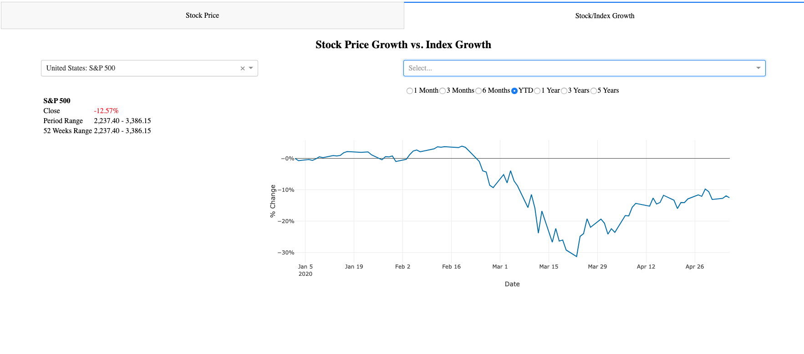
 
Let's add the price growth of General Electric (GE) and Apple (AAPL) to compare with the growth of S&P 500. On the other dropdown list, let type or select GE and AAPL. And the dashboard will add the growth of GE and AAPL stock price.
 
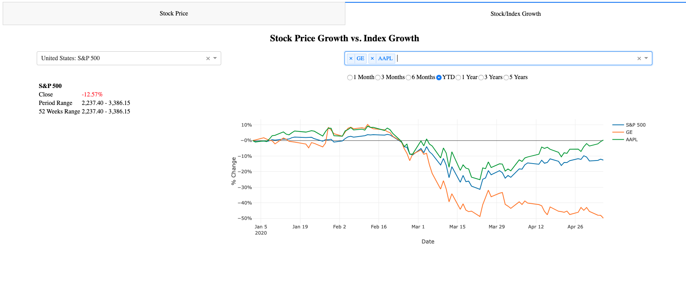
Now if you look at the chart, you may find that GE is underperformed while AAPL is outperformed. 

## Gallery
Stock Price of HSBC Holdings (0005.HK), YTD:
 
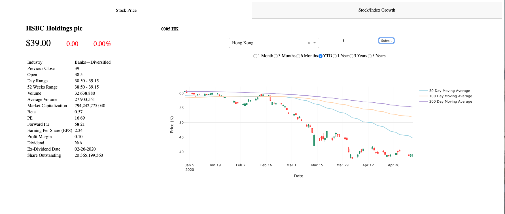
 
 
Compare stock price of HSBC Holdings (0005.HK) with Heng Seng Index, YTD:
 
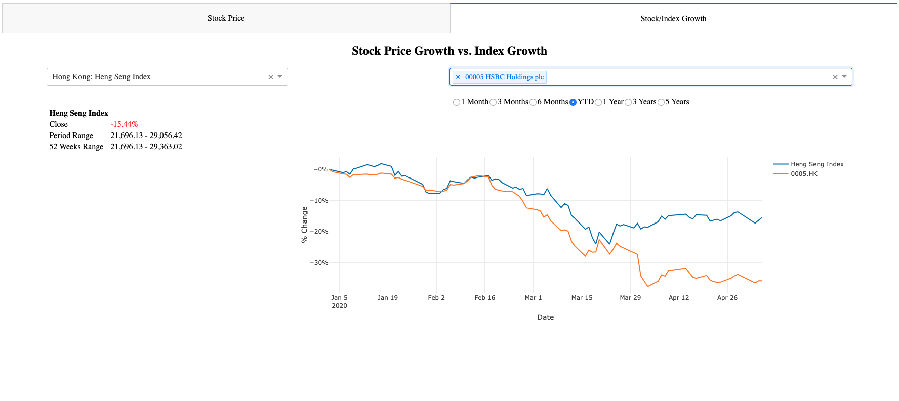
 
 
Compare stock price of HSBC Holdings (0005.HK) with Heng Seng Index, in 5 years interval:
 
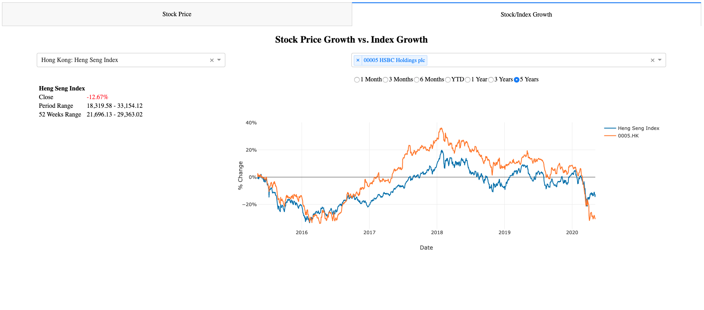
 
 
Stock Price of Cathay Pacific Airways (0293.HK), YTD:
 
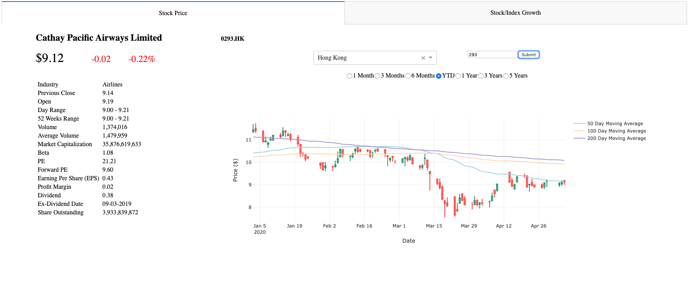
 
 
Stock Price of Apple, Inc (AAPL), YTD:
 
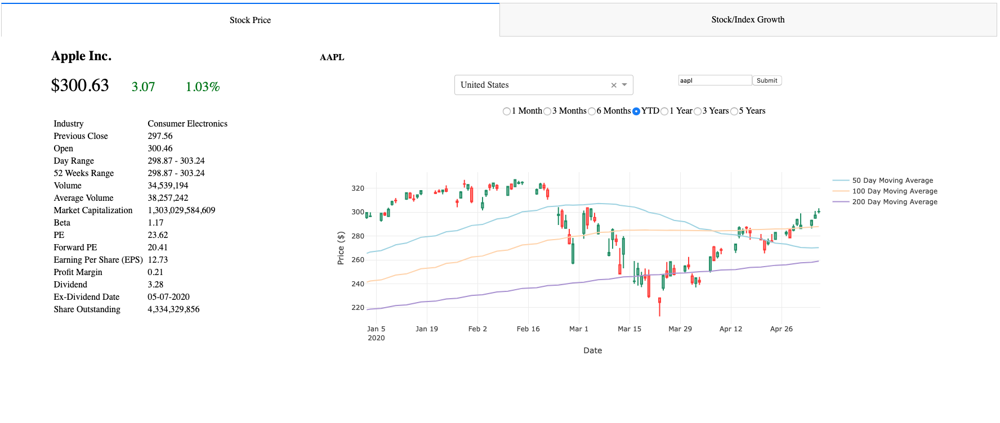
  
Stock Price of Microsoft Corp., in 1 month interval:
 
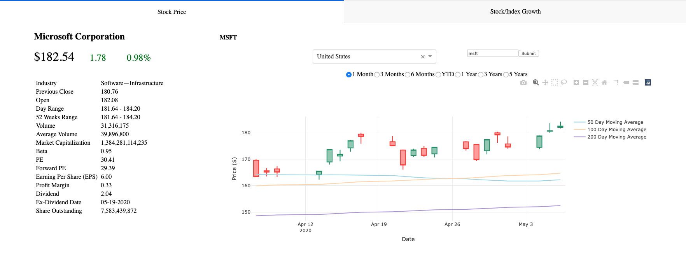
  
Stock Price of Coca-cola Company, in 3 years interval:
 

## Next Part
You may go back to the front page by clicking <a href="https://github.com/jacquessham/StockAnalytics">Here</a>.
 
Coming Soon...